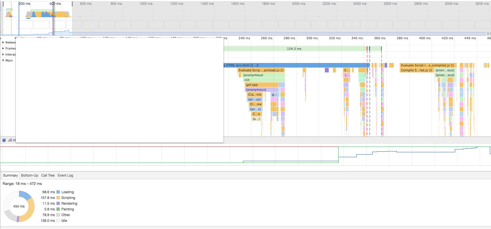

偶然间看到一篇关于前端优化策略的文章，提到了一条“避免页面中空的 `href` 和 `src`”，原文是这样的：
> 当 `<link>` 标签的 `href` 属性为空，或 `<script>`、``、`<iframe>` 标签的 `src` 属性为空时，浏览器在渲染的过程中仍会将 `href` 属性或 `src` 属性中的空内容进行加载，直至加载失败，这样就阻塞了页面中其他资源的下载进程，而且最终加载到的内容是无效的，因此要尽量避免。

直觉告诉我这种说法可能不太准确，于是决定验证一下。
<!-- more -->
## 验证前的准备

实验开始前要明确 `href` 和 `src` 的区别：
 - `src` 用于替换当前元素，`href` 用于在当前文档和引用资源之间确立联系。
 - `src` 是 source 的缩写，指向外部资源的位置，指向的内容会嵌入到文档中当前标签所在的位置；在请求 `src` 资源时会将其指向的资源下载并应用到文档内，比如 img 图片，js 脚本等。当浏览器解析到该元素时，会暂停其他资源的下载和处理，直到将该资源加载执行完毕。这也是为什么要将 js 脚本放在底部而不是头部的原因。
 - `href` 是 hypertext reference 的缩写，意思是指向网络资源所在位置（的超链接），用来建立和当前元素或文档之间的连接，当浏览器识别到它他指向的文件时，就会并行下载资源，不会停止对当前文档的处理。
 - 综上，`src` 是先加载在运行后面的代码，`href` 是边加载边运行后面的代码，这也是为什么我会觉得上面提到的文章中描述不准确的原因之一。

而且，由于验证的是对浏览器渲染的影响，浏览器的渲染过程需要了解： [浏览器渲染过程](https://pandapm.github.io/2017/10/24/Browser-rendering-process/#more)
## 验证过程

我把验证中使用的标签分成了两组：有无 `href` 组和有无 `src` 组，`href` 组验证的标签有 `<a>`、`<link>`，`src` 组以 `` 标签为例。

### `href` 是否为空对文档加载的影响

首先，我创建了一个空白文档，文档中有 1000 个 <link> 标签，就像这样：

```html
<!DOCTYPE html>
<html lang="en">
<head>
    <meta charset="UTF-8">
    <meta name="viewport" content="width=device-width, initial-scale=1.0">
    <meta http-equiv="X-UA-Compatible" content="ie=edge">
    <title>Document</title>
</head>
<body>
    <link rel="stylesheet" href="">
    <link rel="stylesheet" href="">
    ....
</body>
</html>
```
由于编辑器一般都支持 Emmet 语法，所以这一步很好做，也就用时 1s 左右。
然后在浏览器中打开它，并选择 Developer Tools 中的 Performance，进行录制，得到的结果如图：

一张图并不能看出来什么，我们需要把href属性删掉，重新录制一次：

和上一张图很重合，每条关键时间线的位置也很相似，多次试验下来两组数据仿佛没有什么不同。
如果把页面中的元素换成 1000 个 `<a>` 标签，有无空 `href` 的试验结果也很是相似，姑且可以认为 `href` 不是很影响页面渲染速度。

### `src` 是否为空对文档加载的影响
步骤同上，创建了有一千个 img 标签的文档：
```html
<!DOCTYPE html>
<html lang="en">
<head>
    <meta charset="UTF-8">
    <meta name="viewport" content="width=device-width, initial-scale=1.0">
    <meta http-equiv="X-UA-Compatible" content="ie=edge">
    <title>Document</title>
</head>
<body>
    <link rel="stylesheet" href="">
    <link rel="stylesheet" href="">
    ....
</body>
</html>
```
用 Performance 录制如下：


然后删掉 `src` 属性，录制如下：


emmmm，差别就比较大了。从加载时间上看，有 `src` 且 `src` 为空的用例用时1940ms, 而没有 `src` 的用例用时只有不到 400ms。
在有 `src` 且 `src` 为空的用例中，`DOMContentLoaded` 事件触发与 `Loaded` 事件触发之间的时间比较长，隔了有 1550ms 左右，而后者只有 30ms 左右。
仔细观察之后会发现，第一张图的 `DOMContentLoaded` 与 `Loaded` 之间几乎全是 type 类型为 error 的事件：


emmmm，看上去这些 error 是加载 `src` 里的资源（其实是空的）失败的事件，于是验证一下：
创建一个有 1000个 `img` 标签的文档，保留 5 个标签有空的 `src` 属性，其他的标签全部删除 `src` 属性。然后运行录制如下：


虽然 `DOMContentLoaded` 与 `Loaded` 中间穿插了一个很大块的 Layout，但是仔细数一下黄色的小块块，一共有5个 type 是 error 的 Event。
至此可以验证：浏览器在渲染过程中会把 `src` 属性中的空内容进行加载，直至加载失败，影响 `DOMContentLoaded` 与 `Loaded` 事件之间的资源准备过程，拉长了首屏渲染所用的时间。

## 结论
通过实验我们可以得出一个结论：避免使用空的 `src` 属性确实可以缩减浏览器首屏渲染的时间，因为浏览器在渲染过程中会把 `src` 属性中的空内容进行加载，直至加载失败，影响 `DOMContentLoaded` 与 `Loaded` 事件之间的资源准备过程，拉长了首屏渲染所用的时间；但空的 `href` 属性对首屏渲染的影响比较小。