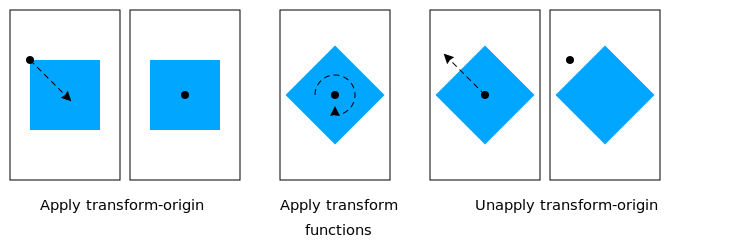

第一部分，position: fixed失效的问题；
第二部分，了解一下由此扯出的一个Stacking Context层叠上下文。
文中大部分内容来自于我对W3C文档及一些英文资料的理解，如有不明确或表述不准确的地方还请指出。
<!-- more -->
## 关于 position: fixed

`position: fixed` 在日常布局中比较常用，如移动端头部和底部导航定位、模态框、悬浮按钮等，设置了这个属性值得元素会相对于屏幕视口（viewport）进行定位，其位置在屏幕进行滚动时会保持不变，不占用文档流中的位置，而且打印时这个元素会出现在 *每一页* 的相同位置。设置了 `position: fixed` 的元素最终的位置由它的 `top`, `right`, `bottom`, `left` 来决定，这个值会创建一个新的 `stacking context`（不知道这个词应该如何准确地翻译，姑且认为是层叠上下文吧）。
但是，有些情况下，这种定位方式会失效，使得元素相对于视窗定位的定位不符合预期（其实是 `fixed` 定位的参考元素变了）。当该元素的父元素中（广义，包含祖先元素）有元素的 `transform` 或 `perspective` 的值不是 `none`，该元素就会相对于这个父元素而不是视口进行定位。
具体的原因是这样：

 > Specifying a value other than none for the transform property establishes a new local coordinate system at the element that it is applied to. The mapping from where the element would have rendered into that local coordinate system is given by the element’s transformation matrix. Transformations are cumulative. That is, elements establish their local coordinate system within the coordinate system of their parent. From the perspective of the user, an element effectively accumulates all the transform properties of its ancestors as well as any local transform applied to it. The accumulation of these transforms defines a current transformation matrix for the element.

解释一下，`transform` 或 `perspective` 的非 `none` 值会影响元素的包含块和层叠上下文，这些值会在应用它的元素上建立一个局部的坐标系（X轴向右水平增加; Y轴垂直向下增加），由变换矩阵（`transform` 的值）给出元素到该局部坐标系的映射，而且 `transform` 带来的局部坐标系的改变是可以累积的——也就是说，子元素会在它的父元素的坐标系内建立子元素自己的局部坐标系：
父元素的 `transform` 们一层层积累定义了子元素当前的变换矩阵（一个元素的变换矩阵是从 `transform` 和 `transform-origin` 属性中计算出来的），步骤如下：

 - 通过 `transform-origin` 的值对坐标原点 `X` 和 `Y` 的位置进行转换
 - 以变换后的 `X`、`Y` 为坐标原点原点，根据 `transform` 的属性值进行变换
 - `X` 和 `Y` 根据 `transform-origin` 的相反值平移回去

如图：

`transform` 会影响最终的渲染效果，但是不影响除overflow外的CSS布局，当通过 `getClientRects()`、`getBoundingClientRect()` 这些接口获取 `client rectangles` 时，`transform` 的效果也会被考虑进去。

可以应用 `transform` 的元素（`transformable elements`）有：
 - 满足CSS盒模型的块级元素或行内元素，或者它的 `display` 值为 `table-row`, `table-row-group`, `table-header-group`, `table-footer-group`, `table-cell`, `table-caption` 中的一个
 - `SVG` 命名空间中具有 `transform`, `patternTransform` 或 `gradientTransform` 属性的元素

p.s. 关于上面的应用transform后元素位置的计算方式，是我按照自己的理解翻译了原文的内容，如有不准确的地方还请指出。原文如下：
 >
 1. Start with the identity matrix.
 2. Translate by the computed X and Y of transform-origin
 3. Multiply by each of the transform functions in transform property from left to right
 4. Translate by the negated computed X and Y values of transform-origin

参考文档：

[The transform Property - W3C Working Draft - 30 November 2017](https://www.w3.org/TR/css-transforms-1/#propdef-transform)

[The Transform Rendering Model - W3C Working Draft - 30 November 2017](https://www.w3.org/TR/css-transforms-1/#transform-rendering)

## 层叠上下文 Stacking Context

通过上文我们知道了有层叠上下文这么一个东西，层叠上下文是HTML元素的三维概念，这些HTML元素在一条假想的相对于面向（电脑屏幕的）视窗z轴上延伸，HTML元素依据其自身属性按照优先级顺序占用层叠上下文的空间。和BFC还有IFC这些xx context一样，创建层叠上下文也是有条件的，文档中的层叠上下文由满足以下任意一个条件的元素形成：

 - 根元素 (HTML),
 - z-index 值不为 `auto` 的 绝对/相对定位元素
 - position 不是 static 的元素（sticky 也会创建层叠上下文，这是一个神奇的实验中的属性值）
 - 一个 z-index 值不为 `auto` 的 flex 项目 (flex item)
 - opacity 属性值小于 1 的元素（参考 [the specification for opacity](https://www.w3.org/TR/css-color-3/#transparency)）
 - `transform` 属性值不为 `none` 的元素
 - `mix-blend-mode` 属性值不为 `normal` 的元素
 - 有 `transform`、`filter`、`perspective`、`clip-path`、`mask / mask-image / mask-border` 这些属性中任意一个或多个属性的元素
 - `isolation` 属性被设置为 `isolate`的元素
 - 在 `will-change 中指定了任意 `CSS` 属性的元素（即使没有直接指定这些属性的值）
 - `-webkit-overflow-scrolling` 属性被设置 `touch`的元素
 - 设置了 `transform-style: preserve-3d` 的元素

在层叠上下文中的子元素也会按照上面的规则进行层叠，子元素的 `z-index` 值只在父级层叠上下文中有意义，*子级层叠上下文*被自动视为*父级层叠上下文*的一个*独立单元*。

但是，并不是创建了新的层叠上下文的元素并不一定都会对其拥有position: fixed的子元素的效果产生影响，
在Chrome（Blink内核）中，可以明确看到产生了影响的是：

 - `transform` 属性值不为 `none` 的元素
 - 设置了 `transform-style: preserve-3d` 的元素
 - `perspective` 值不为 `none` 的元素
 - 在 `will-change` 中指定了任意 `CSS` 属性的元素

但是，在不同的浏览器内核下，上述结论也会有所差异，例如，在 Safari（Webkit内核） 中，只有`transform` 属性值不为 `none` 的元素会对 `fixed` 定位的效果产生影响.

参考文档：

[the specification for opacity - W3C](https://www.w3.org/TR/css-color-3/#transparency)

[The stacking context - MDN](https://developer.mozilla.org/en-US/docs/Web/CSS/CSS_Positioning/Understanding_z_index/The_stacking_context)